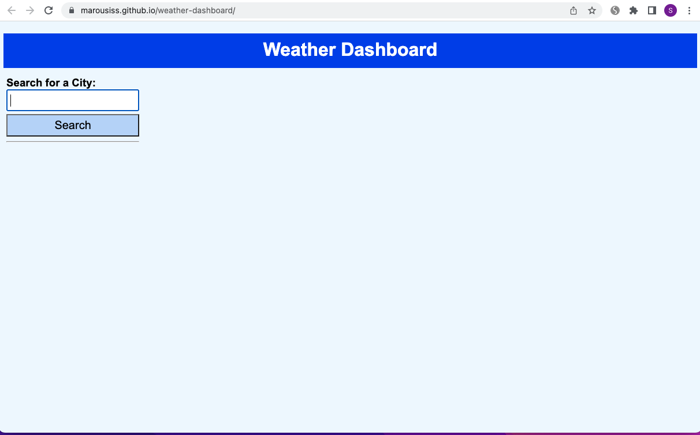
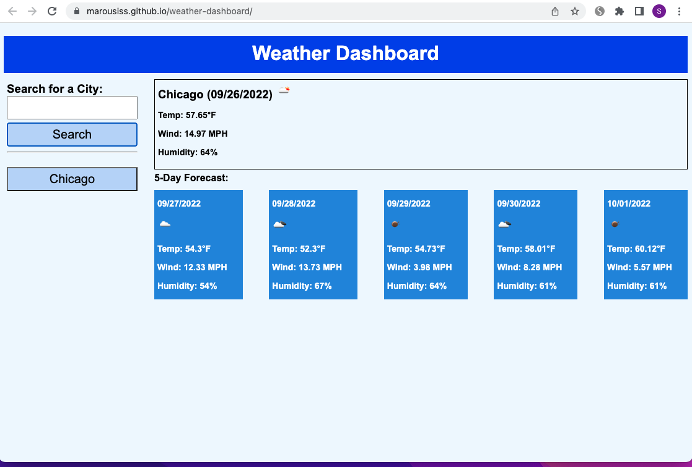
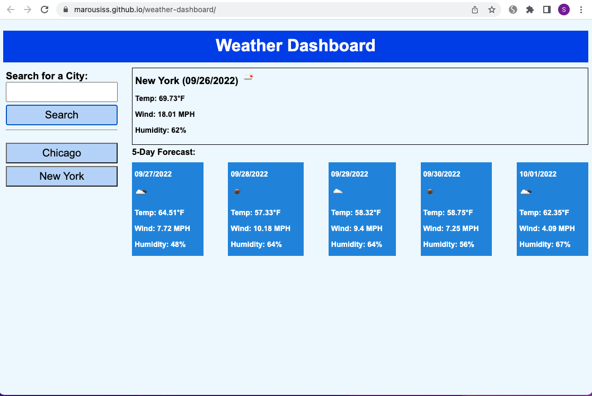

# Weather DashBoard

## Description

A simple weather dashboard application, built to help travelers to check the weather of multiple US cities, so they can make their trip plans accordingly.The app uses a third server API, https://api.openweathermap.org, to get weather information.

## Installation

N/A

## Usage

[weather dashboard link](https://marousiss.github.io/weather-dashboard/)

Screenshots:

# Credits

N/A

## License

N/A